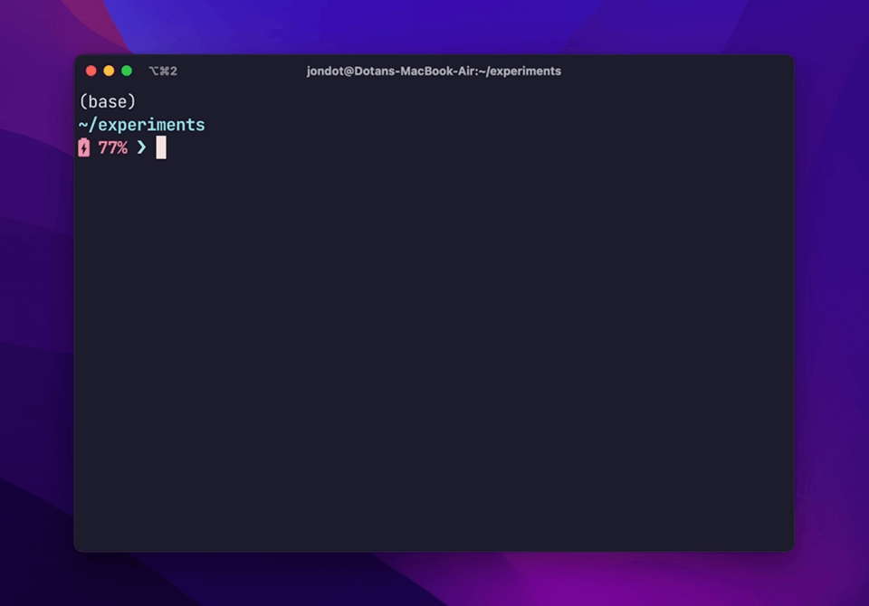

<h1 align="center">
   
   <br/>
   Backpack
</h1>

<h4 align="center">A tool to curate and automate your starter projects</h4>
<p align="center">

</p>
<p align="center">
  <a href="#key-features">Key Features</a> •
  <a href="#how-to-use">How To Use</a> •
  <a href="#download">Download</a> •
  <a href="#contributing">Contributing</a> •
  <a href="#license">License</a>
</p>



## Key Features

* **Generate from full project, subfolders, branches, tags :stars:** - use complete, versions, or any parts of repos you like
* **Shortcuts :rocket:** - create a personal or team  list of your projects with global and local shortcuts
* **Variable replacements** - replace variables in content and path (like cookiecutter)     
* **Automated setup steps :robot:** - run `yarn install` or `make` automatically after a clone
* **Interactive inputs** - define steps to take inputs and select options in YAML while generating a new project
*  **Fast & efficient :running:** - no history or `.git` folder, local caching of content by default, supporting `git` and `tar.gz` download

## How to Use


```
$ bp --help
backpack 2.0.0
Set up projects and download files from existing repos

USAGE:
    bp [OPTIONS] [ARGS] [SUBCOMMAND]

ARGS:
    <shortlink>    A full or short link to a repo (e.g. org/user)
    <dest>         Target folder

OPTIONS:
    -c, --config <config>    Use a specified configuration file
    -f, --fetch              Fetch and apply into the current folder
    -g, --git                Clone with git
    -h, --help               Print help information
    -n, --no-cache           Fetch resources without using the cache
    -V, --version            Print version information
    -w, --overwrite          Always overwrite target file(s)

SUBCOMMANDS:
    add       Save a repo as a project
    cache     Cache handling
    config    Create a personal configuration
    help      Print this message or the help of the given subcommand(s)
```

To download and generate a new project, you can use any repo:

```
$ bp your/repo
```

## Download

For macOS:

```
brew tap rusty-ferris-club/tap && brew install backpack
```

Otherwise, grab a release from [releases](https://github.com/rusty-ferris-club/backpack/releases) and run `bp --help`:


## :hammer: Create starters from ordinary repos

Go to your ordinary repo and follow the `add` wizard:

```
$ cd your-repo
$ bp add
```

## :hammer: Create starters manually

Create a `backpack.yaml`:

```
$ bp config --init
wrote: /Users/jondot/.backpack/backpack.yaml.
```

Configure a starter:

```yaml
projects:
  rust-starter: 
    shortlink: jondot/rust-starter  # you can use any custom prefix here too
    # is_git: true # force fetch from ssh
    actions:
    - name: run an initial build
      run: cargo build
```

And now run:

```
$ bp rust-starter
```

To personalize a project you can take input  and replace content:

```yaml
projects:
  rust-starter: 
    shortlink: jondot/rust-starter  # you can use any custom prefix here too
    actions:
    - name: get app name
      hook: before
      interaction:
        kind: input
        prompt: name of your app
        out: app_name
    swaps:
    - key: APP_NAME
      val_template: "Welcome to {{app_name}}"
      path: "README.md"
```

## :raising_hand_woman:     Configure user projects

`bp` (with no args) will automatically display a list of projects if configure those.

Projects define repos and custom actions and / or swaps you want to attach to each.

Generate a **global user** configuration file:

```
$ bp config --init --global
```

Edit the file:

```
$ vim ~/.backpack/backpack.yaml
```

Add to the `projects` section:

```yaml
projects:
  rust-starter: 
    shortlink: rusty-ferris-club/rust-starter
```

Optionally indicate it is *only* suitable for applying into an existing folder:

```yaml
projects:
  rust-starter: 
    shortlink: rusty-ferris-club/rust-starter
    mode: apply # or new, or remove property.
```


## :rotating_light:     Run actions and user input

You can add custom actions to a project:

```yaml
projects:
  rust:
    shortlink: rusty-ferris-club/rust-starter
    actions:
    - name: 🚨 ====== init git ===========
      run: git init . && git add . && git commit -am "first commit"
    - name: 🚨 ====== first build ========
      run: cargo build
```

You can also add inputs, selections and confirmation, **including variable capture**.

<details><summary>Show full example</summary>

```yaml
actions:
  - name: "Install deps"
    interaction:
      kind: confirm
      prompt: "are you sure?"
    run: yarn install
    ignore_exit: true
  - name: select a DB
    interaction:
      kind: select
      prompt: select a database
      options:
      - sqlite
      - postgres
      - mysql
      default: sqlite
      out: db
  - name: "generate a model"
    interaction:
      kind: input
      prompt: name of your app?
      out: name
    run: yarn run init-app {{db}} {{name}}
```

Actions have a `before` and `after` hook, which make them run **before** copying content (e.g. user input), and **after** the content have being copied (e.g. installing dependencies).

By default actions are hooked to the `after` event, but you can change it:

```yaml
- name: name
  hook: before
  interaction:
    kind: input
    prompt: name of your project
    out: project_name
```

</details>

## :bulb:  Replace content

Define **keys to swap**, where a key can be anything.


* Swaps can happen both in content or path.
* You can limit to a path with a regex
* You can use a `val_template` which pulls a variable from those you gathered while running actions. You also have a set of inflections such as `{{project_name | kebab_case}}`

<details><summary>Show example</summary>

```yaml
projects:
  my-project:
    shortlink: kriasoft/react-starter-kit
    swaps:
    - key: MIT
      val: Apache 2.0
      path: README.md
    - key: AUTHOR_NAME
      val_template: Dr. {{user_name}}
      path: src/.*
```
</details>

# FAQ

<details><summary><b>
How can I set up an enterprise / hosted git, or use Gitlab or others?
</b></summary>
You can use custom git vendors.

Start by generating a **project-local** configuration file:

```
$ bp config --init
wrote: .backpack.yaml.
```

Example: configure a Github Enterprise instance:

```yaml
vendors:
  custom:
    ghe: # <--- this prefix is yours
      kind: github
      base: enterprise-github.acme.org
             # `---- it will point here now
```

And now, you can use the `ghe:` prefix for your shortlinks:

```
$ bp ghe:user/repo
```

You can check in the `.backpack.yaml` to your project to share it with your team. When `backpack` runs it will **pick it up automatically**.

You can also generate a **global user config** by specifying:

```
$ bp config --init --global
```
</details>

<details>
<summary><b>What's the difference between `bp` and `bp -f`?</b></summary>

```
$ bp kriasoft/react-starter-kit my-react-project
```

* Create **a new project**  into `my-react-project`   
* Resolves to [https://github.com/kriasoft/react-starter-kit](https://github.com/kriasoft/react-starter-kit)     
* Finds the default branch, downloads it and caches locally. Next time you run, it'll be much faster.    


```
$ bp -f kriasoft/react-starter-kit/-/.github
```

Let's say you really like how `react-starter-kit` configured its Github Action, and you'd like to copy that to your **existing project**. You can do this:

* Use `/-/` to access a subfolder   
* Use `-f` to overlay files onto your current working directory    

</details>


<details>
<summary><b>Can I generate a project without typing the name of the repo?</b></summary>


```
$ bp
```

And follow the interactive menu, which will let you:

* Pick a project, if you have any configured
* Input a shortlink
* Input a destination or pick an auto generated one

</details>


<details>
<summary><b>What's a shortlink?</b></summary>

A shortlink is a pointer to a Git repo which looks like this:


Any one of these is a legal shortlink:

```
user/repo -> resolves to https://github.com/user/repo
gl:user/repo -> resolves to https://gitlab.org/user/repo
user/repo/-/subfolder -> takes only 'subfolder'
user/repo#wip -> takes the 'wip' branch
```

:white_check_mark: Bare minimum is `user/repo` which defaults to Github.  
:white_check_mark: You can set up a custom prefix if you want.  
</details>


<details>
<summary><b>Is it possible to use backpack only on parts of source repos?</b></summary>

Yes, use the folder notation `/-/`:

```
$ bp user/repo/-/path/to/folder dest-folder
```
</details>

<details>
<summary><b>Can I generate from a given branch?</b>
</summary>

Branches or tags can be used with the `#branch` specifier.

```
$ bp kriasoft/react-starter-kit#feature/redux my-starter
```
</details>

<details><summary><b> Can I use backpack on empty or populated directories?</b></summary>

Yes. Use `-f` to grab content and apply it to an existing empty or populated directories:

```
$ cd your-directory
$ bp -f user/repo
```

</details>


<details><summary><b>Can backpack work on self hosted Git servers?</b></summary>

If it's one of the supported vendors, you can create a custom prefix configuration:

```yaml
vendors:
  custom:
    gh:
      kind: github
      base: github.acme.com/my-org
```

Note that in addition to the custom hosted `github.acme.com` server, we also specified a default org `my-org` above, so it saves a bit of typing. Then you can run:

```
$ bp gh:my-repo my-repo
```
</details>

<details><summary><b>Can backpack infer the name of the destination folder and save me some more typing?</b></summary>

Where it's non ambiguous, yes. For example, when you specify a subfolder:

```
$ bp user/repo/-/my-folder
```

Will grab just `my-folder` from `user/repo` and create in a destinaton folder called `my-folder`.

If there's a inference strategy you think will work, open an issue or submit a PR.
</details>

<details><summary><b>How to install backpack globally?</b></summary>

With `Homebrew` it happens automatically. Otherwise, download a binary and add its containing folder to your `PATH` in the way that's supported by your OS.

We're accepting PRs for other OS specific installers.
</details>

<details><summary><b>Any requirements or dependencies for backpack?</b></summary>

Just `git` to exist (and we will eventually remove that dependency). Other than that the `bp` binary is self contained and has no dependencies.

</details>
<details><summary><b>Can I get a single file?</b></summary>

Yes. `backpack` will act differently when the source is a file, it will do what you're expecting it to.

For example, this will give you a `.gitignore` file from another project:

```
$ cd my-project
$ bp -f rusty-ferris-club/backpack/-/.gitignore
$ tree
.gitignore
```

This will copy just a single workflow file, but also the entire hierarchy of folders:

```
$ cd my-project
$ bp -f rusty-ferris-club/backpack/-/.github/workflows/build.yml
$ tree
.github/
  workflows/
    build.yml
```

Or in other words:

1. When you specify a target file verbatim, it will use that
2. If you're not specifying a target file, the destination file and folder path will be copied from the source.
</details>

# Contributing

We are accepting PRs. Feel free to [submit PRs](https://github.com/rusty-ferris-club/backpack/pulls).

To all [Contributors](https://github.com/rusty-ferris-club/backpack/graphs/contributors) - you make this happen, thanks!

# License

Copyright (c) 2022 [@jondot](http://twitter.com/jondot). See [LICENSE](LICENSE.txt) for further details.
