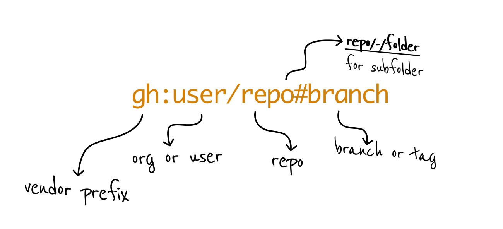

<p align="center">
<br/>
<br/>
<br/>
   
</p>
<hr/>
</p>


# :school_satchel:	 Backpack 

Use template and starter projects easily.

```
$ bp new user/repo
```

:white_check_mark: Create **new projects** or **reuse parts** of projects.    
:white_check_mark: Supports grabbing **repos, subfolders, branches, files**, or tags     
:white_check_mark: Replace **variables** in content and path (like cookiecutter)     
:white_check_mark: Run **custom actions**    
:white_check_mark: Personalize shortlinks and projects for **individuals and teams**   
:white_check_mark: **Fast clone**, no history or `.git` folder    
:white_check_mark: Local **cache support**    


# :rocket: Quick Start

For macOS:

```
brew tap rusty-ferris-club/tap && brew install backpack
```

Otherwise, grab a release from [releases](https://github.com/rusty-ferris-club/backpack/releases) and run `bp --help`:
```
$ bp --help
backpack 1.0.0
Create projects from existing repos

USAGE:
    backpack <SUBCOMMAND>

OPTIONS:
    -h, --help       Print help information
    -V, --version    Print version information

SUBCOMMANDS:
    apply     apply remote files into a folder [projects: a]
    cache     cache handling
    config    create custom configuration
    help      Print this message or the help of the given subcommand(s)
    new       initialize a new project [projects: n]
```


# :hammer: Using Backpack

`bp` scaffolds [projects](https://github.com/topics/template) for you, or copies parts of a project using **shortlinks**, which is a quick and easy way to describe repos and files to copy from them.

You can also save a list of your favorite projects to use as shortcuts.

## :link: What's a shortlink?

A shortlink is a pointer to a Git repo which looks like this:



Any one of these is a legal shortlink:

```
user/repo -> resolves to https://github.com/user/repo
gl:user/repo -> resolves to https://gitlab.org/user/repo
user/repo/-/subfolder -> takes only 'subfolder'
user/repo#wip -> takes the 'wip' branch
```

:white_check_mark: Bare minimum is `user/repo` which defaults to Github.  
:white_check_mark: You can set up a custom prefix if you want.  

## :golf: Swaps, variables, and actions

To maximize producitivity, you can do either of these, or all of these in sequence:

1. Just copy material from a template repo, as a faster `git clone` that has built-in cache and knows how to take **parts of repos**.
2. Embed **placeholder variables** in your template repo and have `backpack` swap these when doing `bp new` or `bp apply`
3. **Execute actions** for input taking from a user, or for running install actions after a clone


You can build a `.backpack-project.yml` into your template repo for defining actions and variables, or a `project` pointing to that repo in your central `backpack.yml`.

## :speedboat: Scaffolding interactively

```
$ bp new
or
$ bp apply
```

And follow the interactive menu, which will let you:

* Pick a project, if you have any configured
* Input a shortlink
* Input a destination or pick an auto generated one

## :building_construction:	 Scaffolding new projects


```
$ bp new kriasoft/react-starter-kit my-react-project
```


:white_check_mark: Use `new` to create **a new project**  into `my-react-project`   
:white_check_mark: Resolves to [https://github.com/kriasoft/react-starter-kit](https://github.com/kriasoft/react-starter-kit)     
:white_check_mark: Finds the default branch, downloads it and caches locally. Next time you run, it'll be much faster.    

You can start with your new project:

```
$ cd my-react-project
$ git init .
$ yarn
```

## :arrow_right_hook:	 Applying/overlaying files onto existing projects

Let's say you really like how `react-starter-kit` configured its Github Action, and you'd like to copy that to your **existing project**. You can do this:

```
$ bp apply kriasoft/react-starter-kit/-/.github
```


:white_check_mark: Use `/-/` to access a subfolder   
:white_check_mark: Use `apply` to overlay files onto your current working directory    

## :evergreen_tree:	 Using branches

Branches or tags can be used with the `#branch` specifier.


```
$ bp new kriasoft/react-starter-kit#feature/redux my-starter
```

## :woman_technologist: Using `git` for private repos

For **private repos**, you might want to download over Git SSH protocol, add `--git` to your commands:

```
$ bp new kriasoft/react-starter-kit --git
```
# :joystick:	Using projects

A project is:

* A shortcut for a repo, subfolder, or files
* A set of actions (inspired by Github Actions) to run automatically after fetching content
* A set of **swaps** which define replacement variables to perform while copying content, such as the name of the project, and/or author name


`backpack` is built for teams. This means you can configure your own shortcuts (called `projects`) to Git hosting vendors, organizations, and repos.

## :raising_hand_woman:	 Configuring user projects


Start by generating a **global user** configuration file:

```
$ bp config --init --global
```
And edit the file:

```
$ vim ~/.backpack/backpack.yaml
```

To add projects you can use the `projects` section:

```yaml
projects:
  rust-starter: 
    shortlink: rusty-ferris-club/rust-starter
```


For projects that are **either** new scaffolds or those which want to take components from, you can specify the mode to show the correct list in the interactive wizard:


```yaml
projects:
  rust-starter: 
    shortlink: rusty-ferris-club/rust-starter
    mode: apply # or new, or remove property.
```

And now you can use:

```
$ bp new rust-starter
```

Which will resolve to the correct location. Note: projects will automatically resolve custom Git vendors (see below for what these are).

### :rotating_light:	 Using actions

Here's a full project configuration example with actions:

```yaml
projects:
  rust:
    shortlink: rusty-ferris-club/rust-starter
    actions:
    - name: 🚨 ====== init git ===========
      run: git init . && git add . && git commit -am "first commit"
    - name: 🚨 ====== first build ========
      run: cargo build
```
 
You can also add inputs, selections and confirmation, **including variable capture**:


```yaml
actions:
  - name: "Install deps"
    interaction:
      kind: confirm
      prompt: "are you sure?"
    run: yarn install
    ignore_exit: true
  - name: select a DB
    interaction:
      kind: select
      prompt: select a database
      options:
      - sqlite
      - postgres
      - mysql
      default: sqlite
      out: db
  - name: "generate a model"
    interaction:
      kind: input
      prompt: name of your app?
      out: name
    run: yarn run init-app {{db}} {{name}}
```

Actions have a `before` and `after` hook, which make them run **before** copying content (e.g. user input), and **after** the content have being copied (e.g. installing dependencies).

By default actions are hooked to the `after` event, but you can change it:

```yaml
- name: name
  hook: before
  interaction:
    kind: input
    prompt: name of your project
    out: project_name
```

### :bulb:	 Using swaps

Define **keys to swap**, where a key can be anything really. Unlike _cookiecutter_, this allows for a fully-building and functioning **template repos** which you can test in CI.


Notes:

* Swaps happen both in content and path, and you can limit to one of those.
* You can limit to a path with a regex
* You can use a `val_template` which pulls a variable from those you gathered while running actions. You also have a set of inflections such as `{{project_name | kebab_case}}`

```yaml
projects:
  my-project:
    shortlink: kriasoft/react-starter-kit
    swaps:
    - key: MIT
      val: Apache 2.0
      path: README.md
    - key: AUTHOR_NAME
      val_template: Dr. {{user_name}}
      path: src/.*
```


## :smiley: Building dedicated template Repos

If you include a `.backpack.yml` file in a repo, `backpack` will use it to understand which actions and swaps to make while copying content.

See [this example](https://github.com/rusty-ferris-club/backpack-e2e-frozen-localproj/blob/main/.backpack-project.yml):

```yml
version: 1
new:
    shortlink: ""
    actions:
    - name: name
      hook: before
      interaction:
        kind: input
        prompt: name of your project
        out: project_name
    swaps:
    - key: crewl
      val_template: "{{project_name}}"
      path: .*
```

You can set different actions and swaps for when people do `bp new` vs `bp apply`.

For file operations such as renaming, moving and so on, you can use vanilla actions (`mv x y`, `rm x`).


## :link: Sharing your projects
You can create a configuration of favorite projects and put it online, to share with your team or save for yourself. Then:

```
$ bp new -r https://<url to YAML>
```

```yaml
# file content:
projects:
  rust:
    shortlink: rusty-ferris-club/rust-starter
```


Running with this remote will show you through the available projects and also offer to save the source in your configuration.

Here's a [an example](https://raw.githubusercontent.com/rusty-ferris-club/backpack-tap/main/main.yaml) from our own [backpack-tap](https://github.com/rusty-ferris-club/backpack-tap) repo.
## :label:	 Custom git vendors

Start by generating a **project-local** configuration file:

```
$ bp config --init
wrote: .backpack.yaml.
```

Example: configure a Github Enterprise instance:

```yaml
vendors:
  custom:
    ghe: # <--- this prefix is yours
      kind: github
      base: enterprise-github.acme.org
             # `---- it will point here now
```

And now, you can use the `ghe:` prefix for your shortlinks:

```
$ bp new ghe:user/repo
```

You can check in the `.backpack.yaml` to your project to share it with your team. When `backpack` runs it will **pick it up automatically**.

You can also generate a **global user config** by specifying:

```
$ bp config --init --global
```


# FAQ

### Is it possible to use backpack only on parts of source repos?

Yes, use the folder notation `/-/`:

```
$ bp new user/repo/-/path/to/folder dest-folder
```

### How do I update projects or remove cache?

Use `bp cache` to manage cached versions. Remove your cache to force updates:

```
$ bp cache --rm
```
To show your cache, use:

```
$ bp cache --path
```

### Can I use backpack on empty or populated directories?

Yes. Use `apply` to grab content and apply it to an existing empty or populated directories:

```
$ cd your-directory
$ bp apply user/repo .
```

### Can backpack work on self hosted Git servers?

If it's one of the supported vendors, you can create a custom prefix configuration:

```yaml
vendors:
  custom:
    gh:
      kind: github
      base: github.acme.com/my-org
```

Note that in addition to the custom hosted `github.acme.com` server, we also specified a default org `my-org` above, so it saves a bit of typing. Then you can run:

```
$ bp new gh:my-repo my-repo
```

### Can backpack infer the name of the destination folder and save me some more typing?

Where it's non ambiguous, yes. For example, when you specify a subfolder:

```
$ bp new user/repo/-/my-folder
```

Will grab just `my-folder` from `user/repo` and create in a destinaton folder called `my-folder`.

If there's a inference strategy you think will work, open an issue or submit a PR.

### How to install backpack globally?

With `Homebrew` it happens automatically. Otherwise, download a binary and add its containing folder to your `PATH` in the way that's supported by your OS.

We're accepting PRs for other OS specific installers.

### Any requirements or dependencies for backpack?

Just `git` to exist (and we will eventually remove that dependency). Other than that the `bp` binary is self contained and has no dependencies.

### Can I get a single file?

Yes. `backpack` will act differently when the source is a file, it will do what you're expecting it to.

For example, this will give you a `.gitignore` file from another project:

```
$ cd my-project
$ bp apply rusty-ferris-club/backpack/-/.gitignore
$ tree
.gitignore
```

This will copy just a single workflow file, but also the entire hierarchy of folders:

```
$ cd my-project
$ bp apply rusty-ferris-club/backpack/-/.github/workflows/build.yml
$ tree
.github/
  workflows/
    build.yml
```


Or in other words:

1. When you specify a target file verbatim, it will use that
2. If you're not specifying a target file, the destination file and folder path will be copied from the source.


# Thanks

To all [Contributors](https://github.com/rusty-ferris-club/backpack/graphs/contributors) - you make this happen, thanks!


# Copyright

Copyright (c) 2022 [@jondot](http://twitter.com/jondot). See [LICENSE](LICENSE.txt) for further details.
