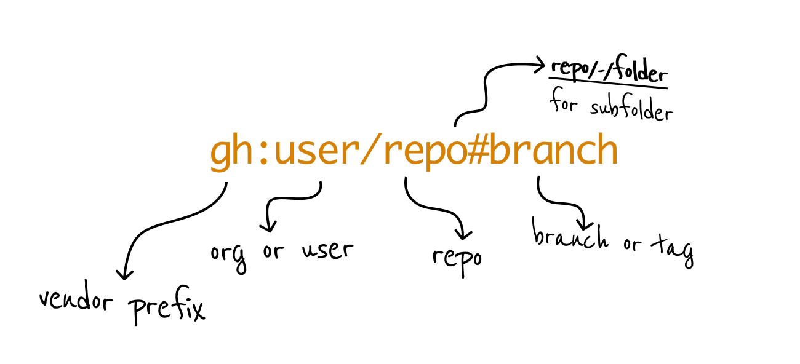

# FAQ

<details><summary><b>
How can I set up an enterprise / hosted git, or use Gitlab or others?
</b></summary>
You can use custom git vendors.

Start by generating a **project-local** configuration file:

```
$ bp config --init
wrote: .backpack.yaml.
```

Example: configure a Github Enterprise instance:

```yaml
vendors:
  custom:
    ghe: # <--- this prefix is yours
      kind: github
      base:
        enterprise-github.acme.org
        # `---- it will point here now
```

And now, you can use the `ghe:` prefix for your shortlinks:

```
$ bp ghe:user/repo
```

You can check in the `.backpack.yaml` to your project to share it with your team. When `backpack` runs it will **pick it up automatically**.

You can also generate a **global user config** by specifying:

```
$ bp config --init --global
```
</details>

<details>
<summary><b>What's the difference between `new` and `apply`?</b></summary>

```
$ bp kriasoft/react-starter-kit my-react-project
```

* Create **a new project**  into `my-react-project`   
* Resolves to [https://github.com/kriasoft/react-starter-kit](https://github.com/kriasoft/react-starter-kit)     
* Finds the default branch, downloads it and caches locally. Next time you run, it'll be much faster.    


```
$ bp -f kriasoft/react-starter-kit/-/.github
```

Let's say you really like how `react-starter-kit` configured its Github Action, and you'd like to copy that to your **existing project**. You can do this:

* Use `/-/` to access a subfolder   
* Use `-f` to overlay files onto your current working directory    

</details>


<details>
<summary><b>Can I generate a project without typing the name of the repo?</b></summary>


```
$ bp
```

And follow the interactive menu, which will let you:

* Pick a project, if you have any configured
* Input a shortlink
* Input a destination or pick an auto generated one

</details>


<details>
<summary><b>What's a shortlink?</b></summary>

A shortlink is a pointer to a Git repo which looks like this:



Any one of these is a legal shortlink:

```
user/repo -> resolves to https://github.com/user/repo
gl:user/repo -> resolves to https://gitlab.org/user/repo
user/repo/-/subfolder -> takes only 'subfolder'
user/repo#wip -> takes the 'wip' branch
```

:white_check_mark: Bare minimum is `user/repo` which defaults to Github.  
:white_check_mark: You can set up a custom prefix if you want.  
</details>


<details>
<summary><b>Is it possible to use backpack only on parts of source repos?</b></summary>

Yes, use the folder notation `/-/`:

```
$ bp user/repo/-/path/to/folder dest-folder
```
</details>

<details>
<summary><b>Can I generate from a given branch?</b>
</summary>

Branches or tags can be used with the `#branch` specifier.

```
$ bp kriasoft/react-starter-kit#feature/redux my-starter
```
</details>

<details><summary><b> Can I use backpack on empty or populated directories?</b></summary>

Yes. Use `apply` to grab content and apply it to an existing empty or populated directories:

```
$ cd your-directory
$ bp -f user/repo .
```

</details>


<details><summary><b>Can backpack work on self hosted Git servers?</b></summary>

If it's one of the supported vendors, you can create a custom prefix configuration:

```yaml
vendors:
  custom:
    gh:
      kind: github
      base: github.acme.com/my-org
```

Note that in addition to the custom hosted `github.acme.com` server, we also specified a default org `my-org` above, so it saves a bit of typing. Then you can run:

```
$ bp gh:my-repo my-repo
```
</details>

<details><summary><b>Can backpack infer the name of the destination folder and save me some more typing?</b></summary>

Where it's non ambiguous, yes. For example, when you specify a subfolder:

```
$ bp user/repo/-/my-folder
```

Will grab just `my-folder` from `user/repo` and create in a destinaton folder called `my-folder`.

If there's a inference strategy you think will work, open an issue or submit a PR.
</details>

<details><summary><b>How to install backpack globally?</b></summary>

With `Homebrew` it happens automatically. Otherwise, download a binary and add its containing folder to your `PATH` in the way that's supported by your OS.

We're accepting PRs for other OS specific installers.
</details>

<details><summary><b>Any requirements or dependencies for backpack?</b></summary>

Just `git` to exist (and we will eventually remove that dependency). Other than that the `bp` binary is self contained and has no dependencies.

</details>
<details><summary><b>Can I get a single file?</b></summary>

Yes. `backpack` will act differently when the source is a file, it will do what you're expecting it to.

For example, this will give you a `.gitignore` file from another project:

```
$ cd my-project
$ bp -f rusty-ferris-club/backpack/-/.gitignore
$ tree
.gitignore
```

This will copy just a single workflow file, but also the entire hierarchy of folders:

```
$ cd my-project
$ bp -f rusty-ferris-club/backpack/-/.github/workflows/build.yml
$ tree
.github/
  workflows/
    build.yml
```

Or in other words:

1. When you specify a target file verbatim, it will use that
2. If you're not specifying a target file, the destination file and folder path will be copied from the source.

</details>
